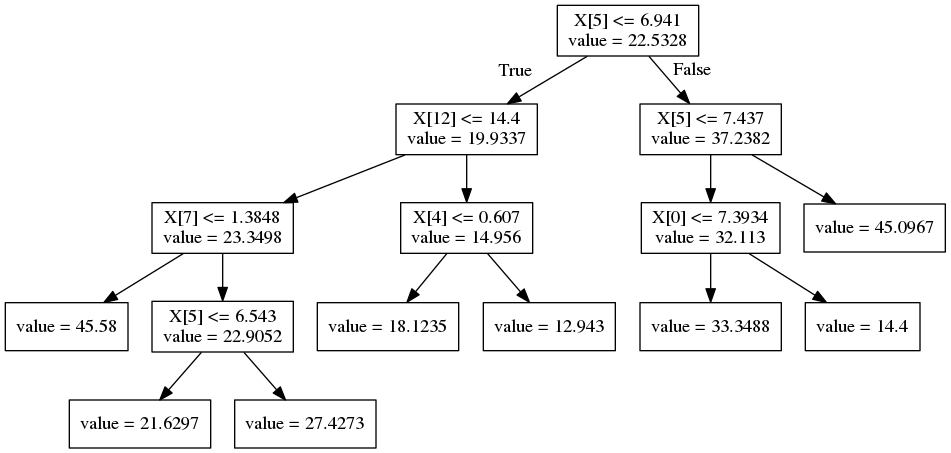

# sklearn-post-prune-tree
this is post-prune tree code for scikit-learn 0.18.0
sklearn post-prune tree software for using n_leaves methods
Prunes the tree to obtain the optimal subtree with n_leaves leaves

Usage
=======

step0: cd ./src

step1: cython _tree_prune.pyx

step2: python setup.py build

setp3: copy the files of _tree_prune.cpython-35m-x86_64-linux-gnu.so and tree_prune.py to ../python3.5/site-packages/sklearn/tree

Pruning
=======

Comparison of pre & post pruning of the tree:

Pruning by the best leaf nodes in the cross-validations:

A common approach to get the best possible tree is to grow a huge tree (for
instance with ``max_depth=8``) and then prune it to an optimum size. As well as
providing a `prune` method for both :class:`DecisionTreeRegressor` and
:class:`DecisionTreeClassifier`, the function ``prune_path`` is useful
to find what the optimum size is for a tree.

The prune method just takes as argument the number of leaves the fitted tree
should have (an int)::

    >>> from sklearn.datasets import load_boston
    >>> from sklearn.tree import tree_prune as tree
    >>> boston = load_boston()
    >>> clf = tree.DecisionTreeRegressor(max_depth=8)
    >>> clf = clf.fit(boston.data, boston.target)
    >>> clf = clf.prune(8)

In order to find the optimal number of leaves we can use cross validated scores
on the data::

    >>> from sklearn.datasets import load_boston
    >>> from sklearn.tree import tree_prune as tree
    >>> boston = load_boston()
    >>> clf = tree.DecisionTreeRegressor(max_depth=8)
    >>> scores = tree.prune_path(clf, boston.data, boston.target, 
    ...    max_n_leaves=20, n_iterations=10, random_state=0)

In order to plot the scores one can use the following function::

    def plot_pruned_path(scores, with_std=True):
        """Plots the cross validated scores versus the number of leaves of trees"""
        import matplotlib.pyplot as plt
        scores = list(scores)
        means = np.array([np.mean(s) for s in scores])
        stds = np.array([np.std(s) for s in scores]) / np.sqrt(len(scores[1]))

        x = range(len(scores) + 1, 1, -1)

        plt.plot(x, means)
        if with_std:
            plt.plot(x, means + 2 * stds, lw=1, c='0.7')
            plt.plot(x, means - 2 * stds, lw=1, c='0.7')

        plt.xlabel('Number of leaves')
        plt.ylabel('Cross validated score')

usage the fuction:

    boston = load_boston()
    clf = tree.DecisionTreeRegressor(max_depth=8)

    #Compute the cross validated scores
    scores = tree.prune_path(clf, 
                             boston.data,
			     boston.target,
                             max_n_leaves=20, 
                             n_iterations=10,
                             random_state=0)

    plot_pruned_path(scores)

Testing
=======

	>>> from sklearn.datasets import load_boston
	>>> from sklearn.tree import tree_prune as tree
	>>> import pydotplus
	>>> from IPython.display import Image
	>>> from copy import deepcopy

	>>> #pre-prune
	>>> boston = load_boston()
	>>> clf = tree.DecisionTreeRegressor(max_depth=8)
	>>> clf.fit(boston.data,boston.target)
	>>> dot_data = tree.export_graphviz(clf,
	>>>                                 out_file=None,
	>>>                                 feature_names=boston.feature_names
	>>>                                 )
	>>> graph = pydotplus.graph_from_dot_data(dot_data)
	>>> Image(graph.create_png())
	>>> tree.get_max_depth(clf)

	>>> #post-prune
	>>> clf = clf.prune(8)
	>>> tree.get_max_depth(clf)
	>>> dot_data = tree.export_graphviz(clf,out_file=None, feature_names=boston.feature_names)
	>>> graph = pydotplus.graph_from_dot_data(dot_data)
	>>> Image(graph.create_png())

	>>> clf = tree.DecisionTreeRegressor(max_depth=8)
	>>> clf.fit(boston.data,boston.target)
	>>> clf1 = deepcopy(clf)
	>>> tree.get_max_depth(clf1.prune(10))

	>>> for i in range(200,0,-10):
	>>>     clf1 = deepcopy(clf)
	>>>     print(tree.get_max_depth(clf1.prune(i)))

